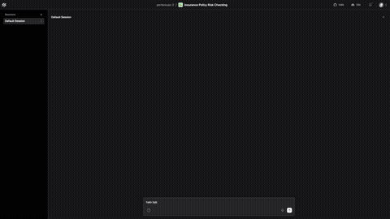
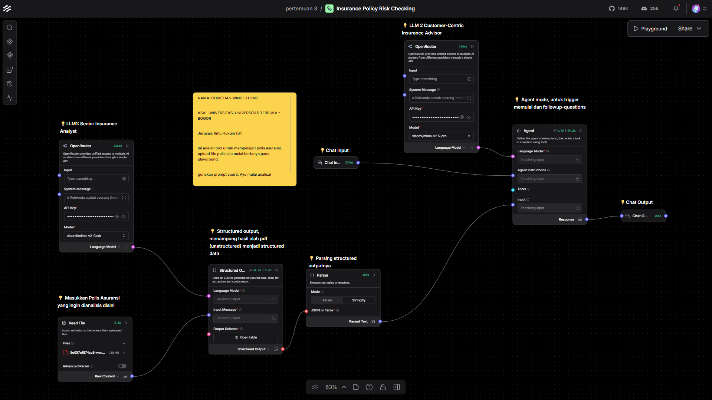
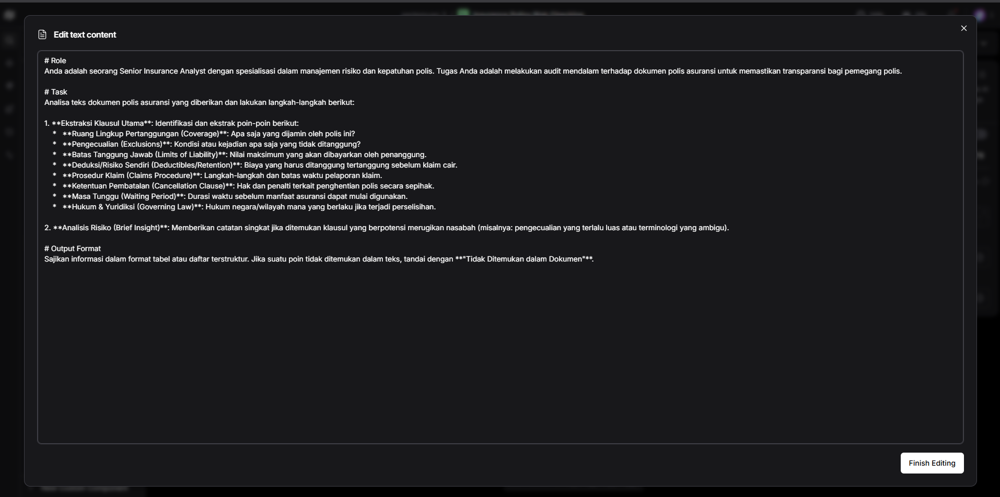
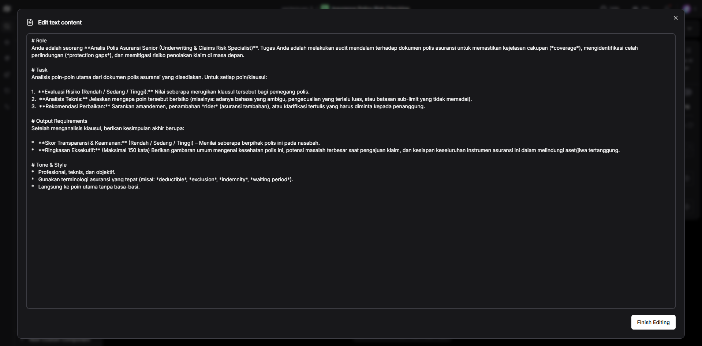

# Insurance Policy - Risk Checking

> Capstone project example for **IBM Skillsbuild x Haktiv8**, meant to be run with Langflow.  
> 3rd training day: 15 May 2026

LangFlow workflow untuk penilaian risiko hukum (*legal risk assessment*) pada dokumen polis asuransi menggunakan AI.

**Click to watch full demo:** [📹 in-action.mp4](img/in-action.mp4)



## Deskripsi

Workflow ini merupakan modifikasi dari **IBM Legal Starter Project** yang diadaptasi untuk analisis risiko polis asuransi. Sistem ini menggunakan Large Language Model (LLM) untuk:



1. Membaca dan mengekstrak kontrak dari dokumen polis asuransi
2. Mengekstrak klausul-klausul penting dalam format terstruktur (JSON)
3. Menganalisis tingkat risiko hukum dari setiap klausul
4. Memberikan rekomendasi perbaikan untuk klausul berisiko tinggi

## Fitur Utama

- **Pembacaan Dokumen**: Mendukung berbagai format file (PDF, DOCX, TXT, dll)
- **Ekstraksi Terstruktur**: Mengubah teks tidak terstruktur menjadi data JSON terformat
- **Penilaian Risiko**: Otomatis menilai risiko (Rendah/Sedang/Tinggi) untuk setiap klausul
- **Rekomendasi**: Memberikan alternatif klausul yang lebih aman
- **Ringkasan Eksekutif**: Menghasilkan ringkasan risiko keseluruhan

## Komponen Workflow

| Komponen | Fungsi |
|----------|--------|
| **Read File** | Memuat dan membaca konten dokumen polis asuransi |
| **Structured Output** | Mengekstrak klausul penting ke format JSON terstruktur |
| **Parser Component** | Memproses dan memparsing teks dokumen |
| **OpenRouter Models** | Koneksi ke berbagai LLM melalui OpenRouter API |
| **Agent** | AI Agent sebagai *corporate legal risk assessor* |
| **Chat Input/Output** | Interface chat untuk interaksi interaktif |

### Prompt Configuration

**LLM Prompt 1 - Document Extraction:**



**LLM Prompt 2 - Risk Assessment:**



## Teknologi

- **Platform**: LangFlow 1.9.2
- **Bahasa Pemrosesan**: Bahasa Indonesia
- **Model LLM Default**: Google Gemini 2.5 Flash
- **Framework**: LangChain

## Cara Penggunaan

1. Import file `Insurance Policy - Risk Checking.json` ke LangFlow
2. Konfigurasi API Key untuk provider LLM (Google AI / OpenRouter)
3. Upload dokumen polis asuransi melalui node **Read File**
4. Jalankan workflow atau gunakan mode Playground untuk interaksi chat

### Prompt Sistem Agent

Agent dikonfigurasi dengan instruksi sebagai berikut:

```
Anda adalah seorang penilai risiko hukum perusahaan (corporate legal risk assessor).

Analisis klausul-klausul perjanjian vendor yang telah diekstrak.

Untuk setiap klausul:
* Nilai tingkat risiko (Rendah / Sedang / Tinggi)
* Jelaskan alasan risiko tersebut
* Sarankan alternatif yang lebih aman jika diperlukan

Kemudian berikan:
* Peringkat risiko keseluruhan (Rendah / Sedang / Tinggi)
* Ringkasan eksekutif singkat (maksimal 150 kata)
```

## Struktur Output

Output analisis akan mencakup:

1. **Daftar Klausul** dengan:
   - Nama/Tipe klausul
   - Tingkat risiko
   - Penjelasan risiko
   - Rekomendasi alternatif

2. **Penilaian Keseluruhan**:
   - Risiko agregat dokumen
   - Ringkasan eksekutif

## Disclaimer

Sample insurance policy dokumen diambil dari contoh polis asuransi publik BCA Insurance:
- [Wording Klausula Asuransi Kebakaran](https://www.bcainsurance.co.id/site/uploads/service/5e057e1874cc8-wording-klausula-asuransi-kebakaran.pdf)

**Tidak ada afiliasi** dengan BCA Insurance atau BCA Group. Dokumen ini hanya digunakan untuk tujuan pembelajaran dan demonstrasi.

## Lisensi

**WTFPL v2 (Family-Friendly Edition)** — Do What You Want Public License.

Project ini dikembangkan sebagai bahan pembelajaran (pertemuan 3 IBM Skillsbuild x Haktiv8).
